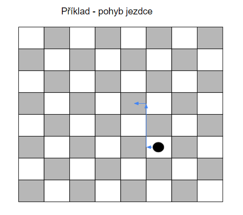

# JVC_Šachy
Tento repozitář obsahuje soubory k projektu vypracovaném na předmětu JVC.

# Popis projektu

## Základní koncept

Cílem projektu je vytvořit počítačem řízené fyzické šachy ovládané hlasem.

Na hladké desce budou umístěny figurky s permanentním magnetem. Pod deskou se bude nacházet dvouosové ovládání pozice elektromagnetu, kterým budou figurky posouvány na příslušná políčka. K ovládání je potřeba správně zapojit a navrhnout krokové motory.
Součástí projektu bude grafická vizualizace šachové desky, která bude sloužit k debuggování a zkoušení funkčnosti softwaru kontrolující šachová pravidla.
Šachy budou ovládány hlasovými příkazy.

## Popis dílčích úkolů

### Šachovnice

Kvůli limitaci plochy na laser-cutteru bude mít šachovnice rozměry 30x30 cm. Délka strany jednoho políčka bude 3,6 cm, což nechává na kraji šachovnice prostor 12 mm pro označení políček čísly 1-8 a písmeny A-H. Materiál - zatím nerozhodnuto (možnosti: překližka, MDF...). Nutnost uhladit plochu pro dobrý pohyb figurek po šachovnici. Návrh ve fusionu. Černá barva políček a ohraničení bude docílena pomocí rastr módu na laser-cutteru.

Vedle šachovnice bude umístěno odkladiště na vyhozené figurky.

### Výroba figurek

Figurky budou vytisknuty na 3D tiskárně.
Je třeba zajistit, aby figurky byly dostatečně malé a při přesouvání vždy po okraji políčka nenarazily do jiných figurek (viz. ovládání figurek)

### Ovládání figurek

Figurky se budou posouvat pomocí elektromagnetu pod deskou. Aby nenarazily do ostatních figurek, budou se pohybovat po okrajích políček
podle následujícího obrázku:
.

Je třeba také vyřešit vyhazování figurek. (Odsunutí vyhozené figurky z šachovnice před posunutím vyhazující figurky na její místo).

### 2D CNC mechanismus

DOPLNIT

### Grafické rozhraní + pravidla

(Je třeba vzít v úvahu náhrada pěšce za dámu. Také by byla dobrá implementace zpětné vazby od samotného stroje do grafického rozraní - např. když nelze provést zadaný tah/byl zadán neplatný příkaz, tak se to na displayi vypíše.)
DOPLNIT

### Hlasové ovládání

DOPLNIT

### Ovládání motoru arduinem + sériová komunikace

DOPLNIT

# Nákup součástek
K projektu je třeba nakoupit součástky a materiál.
Finance k tomu potřebné rozdělíme.
**!!Důležité!! Ponechejte si účtenky z nákupů, cenu sečteme a mezi všechny rovnoměrně rozdělíme**

## Seznam součástek k nakoupení (nekompletní):
-34 magnetů
-Materiál na desku
-resin na uhlazení desky

# Odkazy
[Tabulka s úkoly](https://docs.google.com/spreadsheets/d/1UUxRAGhn-jtaI4z0dNDnTzgcjV0y25KO_U75sZBlTXc/edit#gid=0)
